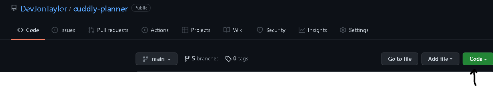
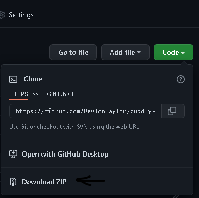
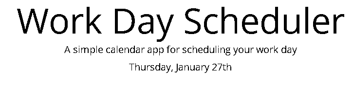
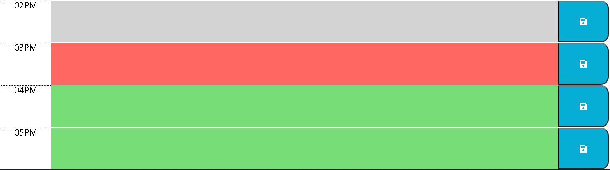
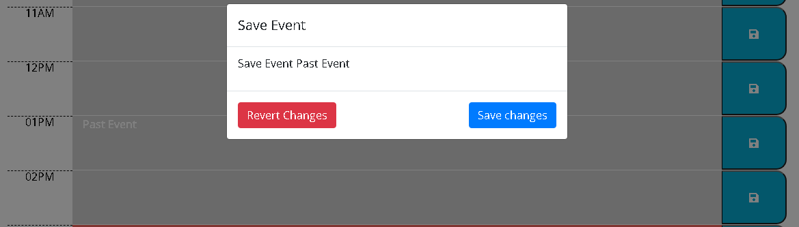
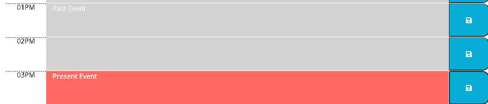

# Work Day Scheduler


This project was a great deal of fun!  Utilizing ES5 to create classes to 
manage TimeBlock's HTMLElements as well as the state I was able to 
successfully create a time blocking app that allowed you to enter 
events at specific hours and save them.  The app prompts only on 
changes if you are sure you want to save the changes or revert to 
what was saved from before.  Items that were not saved will turn bold.
The JavaScript is fully documented so feel free to check out the code.
If the event is scheduled for the previous day then it will be 
forgotten.

## Goals

- [X]  Displays the current date at the time of the page.
- [X]  Each Time Block is dynamically created and maintained.
- [X]  Time Blocks are color coded for Past, Present, and Future.
- [X]  Time Blocks are editable when clicked.
- [X]  User is prompt to save the Time Block or revert on change.
- [X]  Utilize LocalStorage for saving and loading Time Blocks.

## Demo

You can find a demo at [GitHub Pages](https://devjontaylor.github.io/cuddly-planner/).

## Deployment

The dependencies are for:
- [jQuery v3.4.1](https://jquery.com/)
- [Bootstrap v4.3.1](https://getbootstrap.com/)
- [FontAwesome v5](https://fontawesome.com/)
- [MomentJS v2.24](https://momentjs.com/)

A CDN was used so no direct installation or setup needed.  You only 
need an internet connection when opening the page.

### Clone
You can clone the repo using the following command
```bash
  git clone https://github.com/DevJonTaylor/cuddly-planner.git
```

### Download Zip
1. Go to GitHub [Repository](https://github.com/DevJonTaylor/cuddly-planner)
2. Click green Code button
3. Select download zip button at the bottom.




## Examples
### Date at the top of the page

### Color Coded 
- Gray: Past
- Red: Present
- Green: Future

### Saving Events

### Unsaved Events

## License
[MIT](./LICENSE)